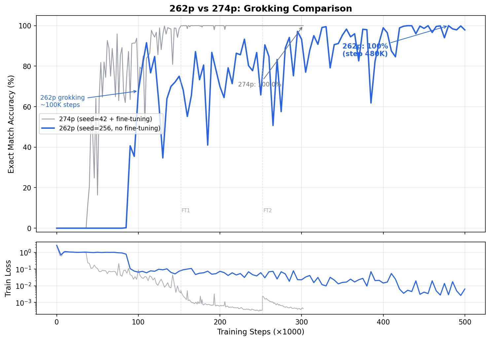

# Grokking 10-Digit Addition with a 274-Parameter Transformer

A **274-parameter** transformer that achieves **99.99% exact-match accuracy** on 100,000 test examples for 10-digit integer addition (10 errors in 100K).

## Results

Evaluated on 10 independent test sets of 10,000 examples each (100,000 total), with seeds disjoint from training:

| Model | Params | Exact Match | Errors / 100K |
|---|---|---|---|
| **274p (seed 42 + fine-tuning)** | **274** | **99.99%** | **10** |

## Architecture

Single-layer, single-head, decoder-only transformer with d_model=4, d_ff=8, vocabulary size 14 (digits 0-9, `+`, `=`, `<PAD>`, `<EOS>`).

| Component | Factorization | Params |
|---|---|---|
| Token embedding (tied) | 14 × 4 | 56 |
| Position embedding (rank-2) | 33×2 + 2×4 | **74** |
| RMSNorm (pre-attn) | weight only | 4 |
| QKV (shareA_tieKV, r=3) | A: 4×3; Bq: 3×4; Bkv: 3×4 | 36 |
| Attention output (r=3) | 4×3 + 3×4 | 24 |
| RMSNorm (pre-FFN) | weight only | 4 |
| FFN up (r=3) | 4×3 + 3×8 | 36 |
| FFN down (r=3) | 8×3 + 3×4 | 36 |
| Final RMSNorm | weight only | 4 |
| Output head | (tied with token embedding) | 0 |
| **Total** | | **274** |

Building on [digit-addition-311p](https://github.com/rezabyt/digit-addition-311p) (311 params, 99.999%), we reduce the model to **274 parameters** via:
- **Rank-2 positional embedding**: 33×2 + 2×4 = 74 params (down from rank-3: 33×3 + 3×4 = 111, saving 37 params)
- All other techniques inherited from 311p: rank-3 factorization, shareA_tieKV, RMSNorm, tied embeddings

## Leaderboard

| Params | Model | Accuracy | Reference |
|---|---|---|---|
| 1,644 | Codex baseline | 99.04% | [Papailiopoulos](https://github.com/anadim/smallest-addition-transformer-codex) |
| 777 | gpt-acc-jax | 99.69% | [Havinga](https://github.com/yhavinga/gpt-acc-jax) |
| 491 | + RMSNorm | 99.97% | [rezabyt](https://github.com/rezabyt/digit-addition-491p) |
| 311 | + shareA_tieKV + d_model=4 + fine-tuning | 99.999% | [rezabyt](https://github.com/rezabyt/digit-addition-311p) |
| **274** | **+ rank-2 positional embedding** | **99.99%** | **This work** |

## Grokking + Fine-Tuning

The 274-parameter model exhibits **delayed grokking**: near-zero accuracy for ~38K steps, followed by a gradual rise to ~99% over 120K more steps. Two rounds of **iterative fine-tuning** with decreasing learning rates then close the remaining gap:

| Stage | LR | Steps | Errors / 100K |
|---|---|---|---|
| Base training | 0.02 | 152K | ~160 |
| Fine-tune 1 | 0.001 | 100K | 10 |
| **Fine-tune 2** | **0.0003** | **50K** | **10** |



## Quick Start

### Install

```bash
pip install torch
```

### Evaluate Pre-trained Checkpoint

```bash
python evaluate_checkpoints.py \
  checkpoints/best_274p_ft2.pt --device cuda
```

Expected output: 99,990 / 100,000 (10 errors across 10 seeds).

### Single Prediction

```bash
python -m src.eval predict \
  --ckpt checkpoints/best_274p_ft2.pt \
  --a 1234567890 --b 9876543210
```

### Train from Scratch

```bash
# Step 1: Base training (200K steps)
python -m src.train \
  --run-name 274p_s42 --d-model 4 --d-ff 8 \
  --pos-rank 2 --qkv-rank 3 --attn-out-rank 3 --ffn-rank 3 \
  --use-rmsnorm --tie-qkv shareA_tieKV \
  --train-steps 200000 --device cuda --seed 42

# Step 2: Fine-tune round 1 (lr=0.001, 100K steps)
python finetune.py \
  results/runs/274p_s42/checkpoints/best.pt \
  --lr 0.001 --steps 100000 --seed 34

# Step 3: Fine-tune round 2 (lr=0.0003, 50K steps)
python finetune.py \
  <best_from_ft1>/checkpoints/best.pt \
  --lr 0.0003 --steps 50000 --seed 17
```

**Note:** Grokking is stochastic and hardware-dependent. Seed 42 is confirmed on A100 GPUs with CUDA 12.x. Always sweep seeds in a new environment.

## Training

3-phase curriculum following [gpt-acc-jax](https://github.com/yhavinga/gpt-acc-jax):
1. Steps 0–2,000: 1–3 digit operands
2. Steps 2,000–7,000: 1–6 digit operands
3. Steps 7,000+: 1–10 digit operands (full range)

AdamW optimizer, peak LR = 0.02, linear warmup (1,350 steps) + cosine decay, min LR = 0.002, weight decay = 0.01, batch size = 512, total steps = 200,000.

## Files

```
src/
  model.py    # Low-rank transformer (RMSNorm, shareA_tieKV, LowRankLinear)
  data.py     # Raw digit tokenization pipeline
  train.py    # Training with curriculum learning
  eval.py     # Evaluation and inference
checkpoints/
  best_274p_ft2.pt   # Best model (274 params, 99.99% on 100K)
evaluate_checkpoints.py  # Multi-seed evaluation script
finetune.py              # Fine-tuning from a saved checkpoint
plot_grokking.py         # Generate training curve plot
```

## References

- D. Papailiopoulos, "[Addition Under Pressure](https://dimitrisp.substack.com/p/addition-under-pressure)," 2026.
- Y. Havinga, "gpt-acc-jax," 2026. [GitHub](https://github.com/yhavinga/gpt-acc-jax)
- rezabyt, "digit-addition-311p," 2026. [GitHub](https://github.com/rezabyt/digit-addition-311p)
- rezabyt, "digit-addition-491p," 2026. [GitHub](https://github.com/rezabyt/digit-addition-491p)

## License

MIT
